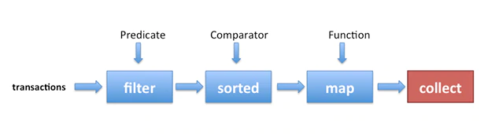
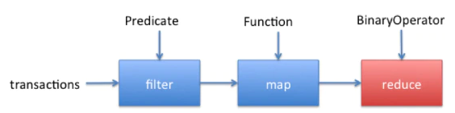
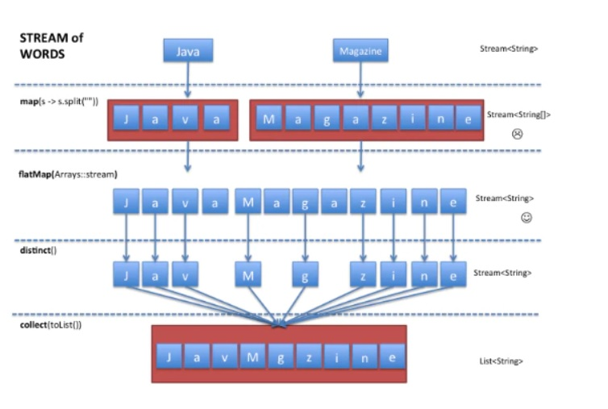

# java-stream

Stream is a new abstract layer introduced in Java 8. Using stream, you can process data in a declarative way similar to SQL statements.

First, we obtain a stream from the list of transactions (the data) using the stream() method available on List. Next, several operations (filter, sorted, map, collect) are chained together to form a pipeline, which can be seen as forming a query on the data.




##### Predicate 

In Java 8, Predicate is a functional interface and can therefore be used as the assignment target for a lambda expression or method reference. 

```
public static Predicate<Employee> isAdultFemale() {
    return p -> p.getAge() > 18 && p.getGender().equalsIgnoreCase("F");
}
 
Predicate<Car> carPredicate = car -> car.getPrice() < 10000;
```

* Predicates move your conditions (sometimes business logic) to a central place. This helps in unit-testing them separately.
* Any change need not be duplicated into multiple places. Java predicate improves code maintenance.
* The code e.g. “filterEmployees(employees, isAdultFemale())” is very much readable than writing a if-else block.


##### Comparator 

The Comparator interface defines a compare(arg1, arg2) method with two arguments which represent compared objects and works similarly to the Comparable.compareTo() method.


```
public class PlayerAgeComparator implements Comparator<Player> {
    @Override
    public int compare(Player firstPlayer, Player secondPlayer) {
       return (firstPlayer.getAge() - secondPlayer.getAge());
    }
}

//Comparator with lambda function :
Comparator<Player> byRanking = (Player player1, Player player2) -> player1.getRanking() - player2.getRanking();
```

The implementation of the compare() method should return

* a negative integer, if the first argument is less than the second,
* zero, if the first argument is equal to the second, and
* a positive integer, if the first argument is greater than the second.

----
## Filter

The filter() method is an intermediate operation of the Stream interface that allows us to filter elements of a stream that match a given Predicate:

```
Stream<T> filter(Predicate<? super T> predicate)
```

Example:

```
List<Customer> customersWithMoreThan100Points = customers
  .stream()
  .filter(c -> c.getPoints() > 100)
  .collect(Collectors.toList());
```

[Link to more filter examples](./src/test/java/examples/Filter.java)

----
## Statistics

Learn to find min and max, sum, count and average


```
Optional<T> min(Comparator<? super T> comparator)
Optional<T> max(Comparator<? super T> comparator)
long count()
OptionalDouble average()
```

Example:

```
Comparator<Employee> comparator = Comparator.comparing( Employee::getAge );
Employee minObject = employees.stream().min(comparator).get();
```

[Link to more statistics examples](./src/test/java/examples/Statistics.java)

----
## Distinct

The Stream API provides the distinct() method that returns different elements of a list based on the equals() method of the Object class.

```
Stream<T> distinct();
```

Example:

```
List<String> distinctElements = list.stream().distinct().collect(Collectors.toList());
```

[Link to more Distinct examples](./src/test/java/examples/Distinct.java)

----
## Mapping

stream().map() lets you convert an object to something else.

```
<R> Stream<R> map(Function<? super T,? extends R> mapper)
DoubleStream mapToDouble(ToDoubleFunction<? super T> mapper)
```

Example:

```
List<String> staffNames = staff.stream().map(x -> x.getName()).collect(Collectors.toList());
```

[Link to more Mapping examples](./src/test/java/examples/Mapping.java)

----
## Group By

The static factory methods Collectors.groupingBy() and Collectors.groupingByConcurrent() provide us with functionality similar to the ‘GROUP BY’ clause in the SQL language. They are used for grouping objects by some property and storing results in a Map instance.

```
static <T,K> Collector<T,?,Map<K,List<T>>> groupingBy(Function<? super T,? extends K> classifier)
```

Example:

```
cars.stream().collect(Collectors.groupingBy(Car::getMake));
```

[Link to more Group By examples](./src/test/java/examples/GroupBy.java)

----
## Reduce

Reduction stream operations allow us to produce one single result from a sequence of elements, by applying repeatedly a combining operation to the elements in the sequence.

```
<U> U reduce(U identity, BiFunction<U, ? super T, U> accumulator, BinaryOperator<U> combiner);
```

* Identity – an element that is the initial value of the reduction operation and the default result if the stream is empty
* Accumulator – a function that takes two parameters: a partial result of the reduction operation and the next element of the stream
* Combiner – a function used to combine the partial result of the reduction operation when the reduction is parallelized, or when there’s a mismatch between the types of the accumulator arguments and the types of the accumulator implementation


Example:

```
List<Integer> numbers = Arrays.asList(1, 2, 3, 4, 5, 6);
int result = numbers.stream().reduce(0, (subtotal, element) -> subtotal + element);
```

[Link to more reduce examples](./src/test/java/examples/Reduce.java)

----
## Flatmap

FlatMap as it can be guessed by its name, is the combination of a map and a flat operation
FlatMap perform mapping each array not with stream but with the contents of that stream. All of the individual streams that would get generated while using map(Arrays::stream) get merged into a single stream.



```
<R> Stream<R> flatMap(Function<? super T,? extends Stream<? extends R>> mapper)
```

Example:

```
// [[Mariam, Alex, Ismail],[John, Alesha, Andre], [Susy, Ali]]
List<String> names = arrayListOfNames.stream().flatMap(List::stream).collect(Collectors.toList());
```

[Link to more flatmap examples](./src/test/java/examples/FlatMap.java)

----
## Sorted

 We can sort the stream in natural ordering as well as ordering provided by Comparator.

* sorted(): It sorts the elements of stream using natural ordering. The element class must implement Comparable interface. 

* sorted(Comparator<? super T> comparator): Here we create an instance of Comparator using lambda expression. We can sort the stream elements in ascending and descending order

```
Stream<T> sorted()
Stream<T> sorted(Comparator<? super T> comparator)
```

Example:

```
List<Person> sortedByAge = people.stream().sorted(Comparator.comparing(Person::getAge)).collect(Collectors.toList());
```

[Link to more sorted examples](./src/test/java/examples/Sorted.java)